# **Twitter Engine Part 1  - COP 5615**

## **Group members -**

1 - Mayur Reddy Junnuthula (UFID - 36921238)

2-  Akhil Srivatsa (UFID - 80826297)

## **Project Description**

In this project, you have to implement a Twitter Clone and a client tester/simulator.

As of now, Tweeter does not seem to support a WebSocket API. As part I of this project, you need to build an engine that (in part II) will be paired up with WebSockets to provide full functionality. Specific things you have to do are:

Implement a Twitter-like engine with the following functionality:
Register account
Send tweet. Tweets can have hashtags (e.g. #COP5615isgreat) and mentions (@bestuser)
Subscribe to user's tweets
Re-tweets (so that your subscribers get an interesting tweet you got by other means)
Allow querying tweets subscribed to, tweets with specific hashtags, tweets in which the user is mentioned (my mentions)
If the user is connected, deliver the above types of tweets live (without querying)
Implement a tester/simulator to test the above
Simulate as many users as you can
Simulate periods of live connection and disconnection for users
Simulate a Zipf distribution on the number of subscribers. For accounts with a lot of subscribers, increase the number of tweets. Make some of these messages re-tweets
Other considerations:
The client part (send/receive tweets) and the engine (distribute tweets) have to be in separate processes. Preferably, you use multiple independent client processes that simulate thousands of clients and a single-engine process
You need to measure various aspects of your simulator and report performance
More detail in the lecture as the project progresses.

## **Important Run Commands** 

1) client:start().
2) main_server:start_link().
3) simulator:start_link().

## **Twitter High Level Architecture**

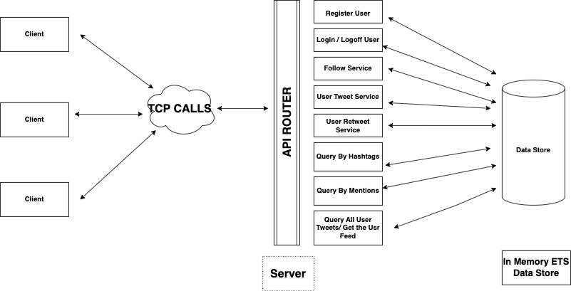

## **File Structure and Application Details**

As we can see in the above diagram, the Twitter system has been implemented using a client server architecture -

1) **Client.erl** - 

This file contains the implementation details of the client. Once the project is compiled, the start function in the file can be 
called using the command - "**client:start()**" which will start the client.  This function will spawn an actor process that is responsible for handling 
all the requests from the client side and sending a request to the server. The response from the server will be printed here.
The requests to the server are sent by opening a TCP connection with the server. The client connects to the server using the ip address
of the server. (Can be seen in Line 34 of the file)

The requests to the client can be sent using the following commands - 

- For User Registration -init_services ! {"register_user" , "virat", "@12211991"}.
- For User Login -       init_services ! {"login_user" , "virat", "@12211991"}.
- For User Logoff -      init_services ! {"logoff_user" , "virat", "@12211991"}.
- For User Follow -      init_services ! {"user_follow" , "virat", "mayur"}.
- For Sending Tweets -   init_services ! {"send_tweet", "virat", "@akhil #COP5615 is not a boring class."}
- For Retweets -  init_services ! {"retweet", "virat", "1"} - The third parameter here is the tweet Id.
- For Querying Tweets Using Hashtags - init_services ! {"get_all_hashtags", "COP5615"}
- For Querying Tweets Using Mentions - init_services ! {"get_all_mentions", "akhil"}
- For Getting all the User Tweets / User Feeds - init_services ! {"getMyTweets", akhil}

2) **Server.erl**

This file contains the implementation details of the server. The server can be started using the command - "**main_server:start_link()**".
The server initializes all the ETS_TABLES, opens up a TCP listener that is used to acknowledge all the requests from the client.
Depending upon the request from the client , the TCP listener routes the request to the API_HANDLER. This API_HANDLER is responsible 
for perform CRUD operations from the database. (**In memory ETS Store**). The server here is also responsible for distributing the tweets
to several users through TCP sockets.

3) **Simulator.erl** -

This file deals with the second part of the project i.e to implement a simulator. The simulator can be started using the command - "**simulator:start_link**".
It takes the "**number of users**", "**max no.of tweets**", "**percentage of users to disconnect**" as an input and performs the 
following operations in order - 

- Perform User Registration and Login for the no.of Users provided in the input.
- Perform a bulk follow operation.
- Send Tweets / Retweets (Here every 10th tweet a user makes is a retweet, every 3rd tweet will have a hashtag and every 5th tweet will have a mention).
- Query all the tweets using Hashtag.
- Query all the tweets using Mention.
- Query all the tweets of Users (GET THE USER FEED).

**Zip F Distribution -** 

Here, the no.of tweets that a user makes is determined using ZIP F Distribution. The user with maximum no.of followers sends the "maximum no.of tweets".
The second most popular user will perform "maximum no.of tweets / 2" tweets. The third most popular user will perform "maximum no.of tweets / 3" tweets
and so on. The parameter "maximum no.of tweets" is taken as an input from the user.

**Periods of Live Connection and Disconnection**

Depending upon the parameter "percentage of users to disconnect", the users are periodically disconnected. This is taken as an input from the user. 
**Please note that, the no.of users that will be disconnected will always be less than "percentage of users to disconnect".**

## **Performance Graphs -**

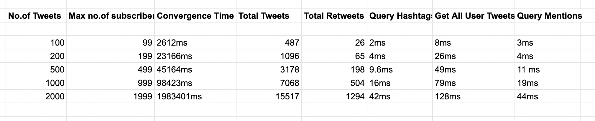

The performance results are taken for the parameter - "no.of users to disconnect" = 0. This means that all the users in the system are
active and the tweets will be delivered to all online users. The performance results will be much faster, when 
the "**no.of users to disconnect > 0**" as the tweets will not have to be delivered to every subscribed user.

The logic to distribute the work is on the server side. For our testing purposes, we are running both the client and server on the same 
system.  We were able to test for a maximum of 2000 users, but we are confident that, in a real life scenario our system can scale up to 
100x depending on the CPU power of the server,

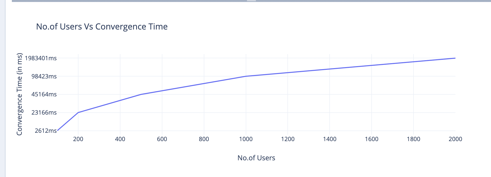

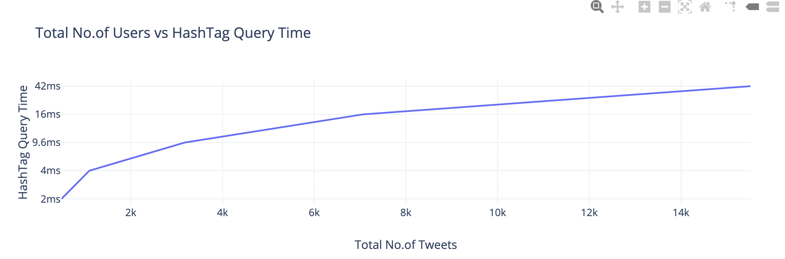

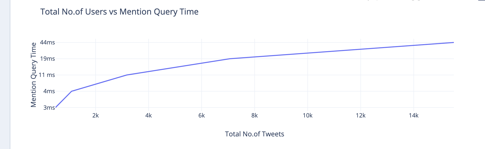

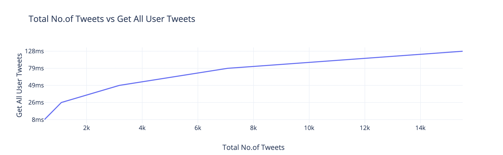

**Some Samples of Request/ Response -**

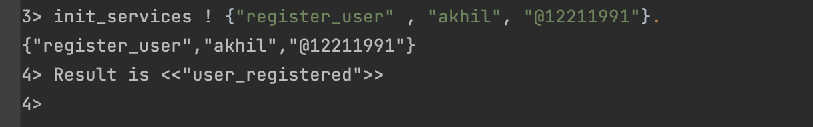

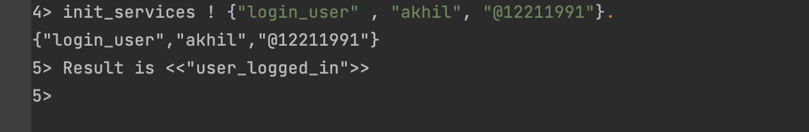

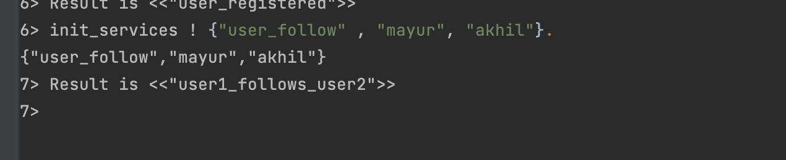

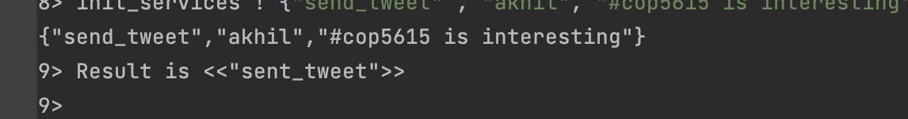

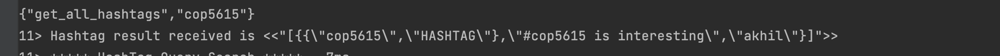

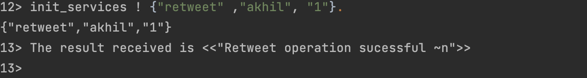

